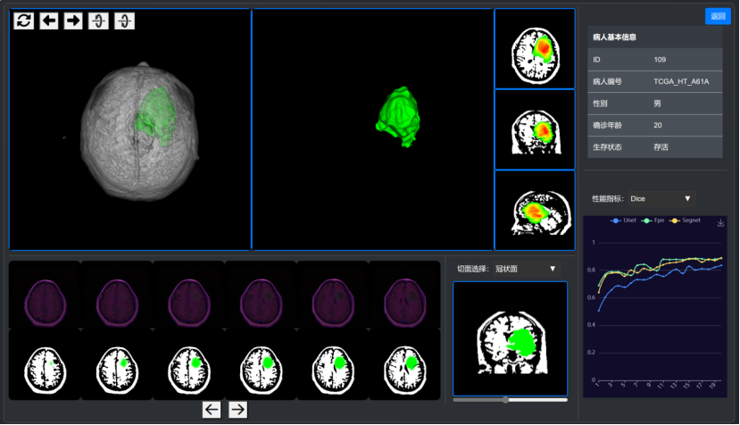

A project during my junior summer vocation. 
My job is to visualize the brains and correspoding tumors from two-dimension to three dimension , cut into three anatomical planes and provide various views for users like doctors.
If you wanna use this, you have to get the two-dimension images both brains and tumors, and they should be named in a regular order.
My results are as fellow, and you can try it!
